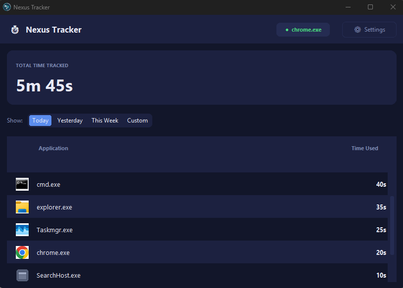

<div align="center">

# ⏱️ Nexus Tracker

**A lightweight Windows desktop app that automatically tracks how you spend your time on your PC.**

[](#-requirements)
[](#-requirements)
[](#-tech-stack)
[](#-database)
[](#-license)

</div>

---

> ⚠️ **Windows only.** Nexus Tracker is built specifically for Windows and relies directly on Windows-only APIs (registry, Win32 GDI, `ctypes.windll`) for autostart, icon extraction, and idle detection. It is **not compatible with macOS or Linux** in its current form. See [Requirements](#-requirements) for details.

Nexus Tracker runs quietly in your system tray, silently watching which application is currently in focus, and logs the time you spend in each one — automatically, accurately, and without getting in your way. Open the app any time to see a clean breakdown of *Today*, *Yesterday*, *This Week*, or any *custom date range* you choose.

---

## 📖 Table of Contents

- [Features](#-features)
- [Screenshots / Layout](#-screenshots)
- [Tech Stack](#-tech-stack)
- [Architecture](#-architecture)
- [Project Structure](#-project-structure)
- [Database](#-database)
- [Requirements](#-requirements)
- [Download](#-download)
- [Installation](#-installation)
- [Configuration](#-configuration)
- [Roadmap](#-roadmap)
- [Contributors](#-contributors)
- [License](#-license)

---

## ✨ Features

### 🔄 Automatic activity tracking
- Polls the currently active window at a configurable interval (**5 seconds** by default).
- Resolves the process name and full executable (`.exe`) path of the app in focus via `psutil` + `pywinctl`.
- Accumulates usage time per application into a local SQLite database with **zero user interaction required**.
- Handles midnight rollover automatically — usage always lands on the correct calendar day.

###  Smart idle detection
- Uses the native Windows API (`GetLastInputInfo` via `ctypes`) to detect the last keyboard/mouse input — no extra dependencies.
- Automatically pauses time counting once the configurable idle threshold (**5 minutes** by default) is reached, so idle time never inflates your stats.
- Correctly handles the 32-bit tick-count wraparound (~49.7 days uptime) without ever misreporting idle time.

###  System tray integration
- Runs silently in the background as a tray icon (`pystray`), staying out of your way.
- Right-click menu with:
  - **Open Nexus Tracker** — restore the main window.
  - **Pause Tracking** — toggle tracking on/off with a live checkmark indicator.
  - **Quit** — fully exit the application.
- Closing the window (✕) **minimizes to tray** instead of quitting — exactly how a proper background monitoring tool should behave.
- Tray tooltip updates live to reflect the current paused/active state.

###  Polished, modern dark UI
- Custom-built dark theme (CustomTkinter) with a consistent color system — not the default Tk look.
- **Live status badge** in the header, updated every refresh cycle:
  - 🟢 `● Tracking` — shows the current app name.
  - ⚪ `○ Idle` — no input detected.
  - 🟡 `⏸ Paused` — tracking manually paused.
- **Total Time Tracked** summary card, auto-refreshing every 10 seconds.
- Responsive layout that gracefully resizes down to a 700×520 minimum window size.

###  Flexible time-range filters
| Filter | Description |
|---|---|
| **Today** | Usage for the current calendar day |
| **Yesterday** | Usage for the previous calendar day |
| **This Week** | Aggregated usage from Monday to today |
| **Custom** | Any date range, entered as `YYYY-MM-DD`, with automatic start/end swap if entered in reverse |

###  Detailed, sortable usage table
- One row per application, automatically sorted by **most time used first**.
- Each row shows:
  - The application's real icon (extracted from its `.exe`).
  - Process name.
  - Total time in a clean, human-readable format (`1h 23m`, `45m 10s`, `12s`).
- Clean empty-state messaging when no data is available for the selected period.
- Alternating row backgrounds for easy scanning, in a fully scrollable list.

###  Automatic icon extraction & caching
- Extracts each application's real icon directly from its executable using the Win32 GDI API (`win32gui`, `win32ui`).
- Caches extracted icons to disk (keyed by MD5 hash of the exe path) so extraction only happens **once per application**, keeping the UI fast.
- Gracefully falls back to a clean, hand-drawn default icon if extraction fails — the app never crashes or shows a broken icon.

###  Autostart with Windows
- One-click toggle in **Settings** to launch Nexus Tracker automatically when Windows starts.
- Registers itself under the current user's registry key (`HKCU\...\Run`) — **no administrator rights required**.
- Works identically whether running as a raw Python script or as a compiled `.exe` (e.g. via PyInstaller).

###  Persistent, resilient settings
- All preferences (poll interval, idle threshold, autostart) are stored in `config/settings.json`.
- Automatically falls back to safe defaults if the settings file is missing, deleted, or corrupted — the app never fails to start because of a bad config file.

###  Built-in logging
- Every important event (startup, shutdown, DB status, errors) is logged to:
  `%APPDATA%\NexusTracker\app.log`
- Makes diagnosing issues on a user's machine straightforward, without needing to reproduce the issue live.

---

## 🖼 Screenshots



---

## 🛠 Tech Stack

| Layer | Technology |
|---|---|
| UI | [CustomTkinter](https://github.com/TomSchimansky/CustomTkinter) |
| Tray icon | [pystray](https://github.com/moses-palmer/pystray) |
| Active-window detection | [pywinctl](https://github.com/Kalmat/PyWinCtl) + [psutil](https://github.com/giampaolo/psutil) |
| Idle detection | Windows API (`ctypes` + `user32`/`kernel32`) |
| Icon extraction | Win32 GDI API (`pywin32`) |
| Image processing | [Pillow](https://github.com/python-pillow/Pillow) |
| Persistence | SQLite (`sqlite3`, WAL mode) |
| Autostart | Windows Registry (`winreg`) |

---

## 🏗 Architecture

Nexus Tracker is built around **three cooperating threads**:

| Thread | Responsibility |
|---|---|
| **Main Thread** | Runs the Tkinter event loop; the *only* thread allowed to touch UI widgets |
| **Tracker Thread** | Polls the active window every N seconds and writes usage data to SQLite |
| **Tray Thread** | Runs the `pystray` blocking loop for the system tray icon |

Cross-thread communication is handled safely through a `queue.Queue`: tray actions (open / pause / quit) are pushed onto the queue and drained on the main thread via `root.after(100, ...)`, which guarantees all UI mutations happen on the Tk thread — no locks, no race conditions.

The SQLite connection is **thread-local** (each thread opens its own connection) and runs in **WAL mode**, allowing the tracker to write and the UI to read concurrently without blocking each other.

---

## 📂 Project Structure

```
activity app/
├── main.py                  # Entry point — wires logging, settings, DB, tracker, UI, and tray together
├── autostart.py              # Windows autostart management via the registry
├── requirements.txt           # Python dependencies
│
├── assets/
│   └── icon.ico               # Application icon
│
├── config/
│   └── settings.json          # Persisted user settings
│
├── core/
│   ├── tracker.py             # Background tracking engine (the core of the app)
│   ├── idle_detector.py        # Idle-time detection via the Win32 API
│   ├── icons.py                # Icon extraction, caching, and fallback generation
│   └── productivity.py         # Time formatting helpers
│
├── storage/
│   ├── db.py                   # SQLite access layer (schema, reads, writes)
│   └── models.py                # Data models: AppSession, DaySummary
│
└── ui/
    ├── main_window.py          # Main CustomTkinter window
    └── tray.py                  # System tray icon and menu
```

---

## 🗄 Database

SQLite database location: `%APPDATA%\NexusTracker\activity.db`

```sql
CREATE TABLE days (
    id   INTEGER PRIMARY KEY AUTOINCREMENT,
    date TEXT NOT NULL UNIQUE          -- ISO-8601, e.g. "2026-07-21"
);

CREATE TABLE app_sessions (
    id            INTEGER PRIMARY KEY AUTOINCREMENT,
    day_id        INTEGER NOT NULL REFERENCES days(id) ON DELETE CASCADE,
    process_name  TEXT NOT NULL,
    exe_path      TEXT,
    total_seconds INTEGER NOT NULL DEFAULT 0,
    UNIQUE(day_id, process_name)
);
```

- Writes use a single `INSERT ... ON CONFLICT DO UPDATE` **upsert** per tick — no read-then-write race, and minimal I/O overhead.
- A crash loses at most one poll interval (≤ 5 seconds by default) of unsaved data.

---

## 💻 Requirements

> ⚠️ **Windows only.** Nexus Tracker relies directly on Windows-specific APIs (`winreg`, `win32gui`/`win32ui`, `ctypes.windll`) for idle detection, icon extraction, and autostart. It will not run as-is on macOS or Linux.

- **Windows 10 or Windows 11** (64-bit)
- Python **3.9+** (only needed if running from source — not required when using the pre-built `.exe`)
- Dependencies (see `requirements.txt`):

| Package | Purpose |
|---|---|
| `customtkinter>=5.2.2` | Modern UI framework |
| `pywinctl>=0.4` | Active window detection |
| `psutil>=5.9.0` | Process inspection |
| `pystray>=0.19.5` | System tray icon |
| `Pillow>=10.0.0` | Image/icon processing |
| `pywin32>=306` | Windows API integration |

---

## 📥 Download

The easiest way to run Nexus Tracker is to download the pre-built Windows executable — no Python installation required.

1. Go to the [Releases](https://github.com/nexus-dev-team/nexus-tracker/releases) page.
2. Download the latest `NexusTracker.exe`.
3. Run it — the app sets itself up automatically on first launch (database, logs, and settings).

> Prefer to run it from source, or want to inspect/modify the code first? See [Installation](#-installation) below.

---

## 🚀 Installation

```bash
# 1. Clone the repository
git clone https://github.com/OmarKamal-Dev/nexus-tracker.git
cd nexus-tracker

# 2. Install dependencies
pip install -r requirements.txt

# 3. Run the app
python main.py
```

On first launch, Nexus Tracker automatically:
1. Initializes the SQLite database if it doesn't already exist.
2. Creates its log directory under `%APPDATA%\NexusTracker`.
3. Registers itself for Windows autostart, if enabled in settings.

---

## ⚙ Configuration

Settings live in `config/settings.json` and can also be edited from the in-app **Settings** dialog:

| Key | Default | Description |
|---|---|---|
| `idle_threshold_seconds` | `300` | Seconds of inactivity before tracking pauses |
| `poll_interval_seconds` | `5` | How often the active window is checked/logged |
| `autostart` | `true` | Whether the app launches automatically with Windows |

---

## 🗺 Roadmap

- [ ] Cross-platform support (macOS / Linux) — *not available yet; the app is currently Windows-only*
- [ ] Visual charts for productivity trends
- [ ] Automatic "productive" vs "unproductive" app classification
- [ ] CSV / PDF report export
- [ ] Custom display names & icons per application

---

## 👥 Contributors

This project was built and maintained by:

| Name | GitHub |
|---|---|
| **Hamza Waleed** | [github.com/hamzawaleednasr](https://github.com/hamzawaleednasr) |
| **Omar Kamal** | [github.com/OmarKamal-Dev](https://github.com/OmarKamal-Dev) |

---

## 📄 License

This project is intended for personal and educational use, and may be freely modified and extended by the contributors.
